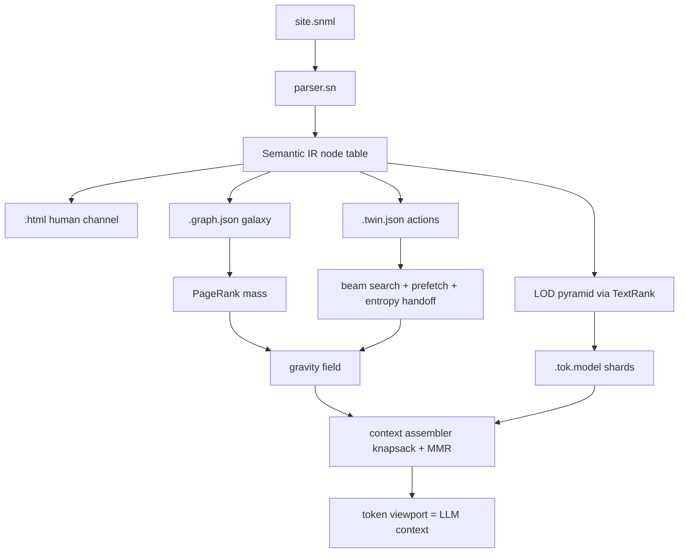

# Vision

### The Reframe (your idea, made precise)

Every "AI browser" today (Perplexity Comet, OpenAI Atlas/Operator, browser agents) is the same thing: **Chromium + an API connector**. The LLM pretends to be a human — it gets HTML made for eyeballs, parses it, screenshots it, clicks simulated buttons. The model is a brain wearing a human costume.

**SN Galaxy inverts this: the browser is not a tool the LLM uses — it is the LLM's perception system.** Content is compiled *for the model* the way HTML is compiled for the eye.

### The Four Pillars (from your own words)

1. **"A galaxy of data, energy, gravity" → the Gravity Relevance Field.** Information is not pages linked by URLs; it is a semantic space where every info-node has **mass** (importance, computed by PageRank over the knowledge graph) and the agent's **goal is a gravity source**. Relevance is a force: `force(n) = mass(n) · sim(goal, n) / dist(agent, n)²`. Browsing = falling toward the heaviest relevant mass. Softmax over forces (with temperature) turns the field into an attention distribution.

2. **"Layers of info pre-calculated" → the LOD Pyramid.** Every node is compiled at 4 Levels of Detail, like mipmaps in graphics: `L0` title (~8 tokens), `L1` extractive summary (~64 tokens, computed at compile time by TextRank — no LLM needed), `L2` full content (~512), `L3` raw. The runtime picks the LOD per node under a token budget — foveated rendering for context windows.

3. **"Each info already encoded/tokenised for each type of LLM" → Token-Native Content.** The compiler emits, next to `.html`, **pre-tokenized shards per model family** (e.g. `page.tok.gemma` for Gemma-class SentencePiece, `page.tok.llama` for BPE). The browser never parses HTML for the model — it streams token shards straight into context. Zero-parse browsing, exact token-budget math known at compile time.

4. **"An extension to the LLM, not an API wrapper" → the Context Assembler.** The browser core is a native SNlang runtime whose viewport IS the model's context window. Browsing = continuously composing the context: `goal → gravity field → LOD knapsack → token shards → context`. A local Gemma-class model (2B, on-device) plugs into this directly in a later phase; v1 is fully deterministic and model-free so every algorithm is testable.

### Why this is a real invention (the moat)

- Comet/Atlas **cannot** do this: they sit on top of a web made for humans. SN Galaxy compiles the content itself — one `.snml` source → human channel + machine channel that can never drift apart.
- It is **algorithm-first**: PageRank, TextRank, BM25, softmax, knapsack, MMR, beam search, entropy — every behavior has a formula, not a vibe.
- It is **honest to your repo**: phase 1 needs zero compiler changes — everything builds today in pure SNlang on `file_read`/`file_write`, string methods, `list<T>`/`map<K,V>`, `dec(X)`.
- It **hardens the language**: writing heavy algorithmic code in SNlang is the best stress test `snc` can get (your stated goal of making the language more reliable).

### What it is NOT (scope honesty)

- Not a Chromium fork, no rendering engine, no crawling the legacy web in v1 (a later `importer` can compile existing HTML *into* a galaxy).
- No model weights inside the compiler; live Gemma integration (FFI/llama.cpp or socket) is Phase 2 — flagged, not hidden.
- Compile-time reactivity (`live<T>`) stays on the roadmap but is decoupled — the galaxy pipeline does not block on it.

# Algorithms

### The Algorithmic Core (each mechanism has a formula)

All implemented in **pure SNlang** as `std/ai` + `galaxy/` modules. Integer/fixed-point arithmetic (scale 10^6) using existing `dec(X)` and `int` paths.

#### 1. Fixed-point math kernel — `std/ai/fixmath.sn`
- `exp_fx(x)`: range-reduced Taylor/Padé series; `ln_fx(x)`: Newton iterations on `exp`.
- `softmax_T(scores, T)`: `p_i = exp((s_i - max_s)/T) / Σ exp((s_j - max_s)/T)` — max-subtraction for stability; **temperature `T` is the browsing knob** (low = laser focus, high = exploration).
- `entropy(p) = -Σ p_i · ln(p_i)` — the confusion meter.

#### 2. Relevance scoring — `std/ai/bm25.sn`
- BM25: `score(goal, n) = Σ_t IDF(t) · tf(t,n)·(k1+1) / (tf(t,n) + k1·(1-b+b·len(n)/avglen))` with `k1=1.2, b=0.75`.
- v1 similarity is lexical (tokenize on whitespace/punct via `.split()`, `.lower()`); embedding similarity is a drop-in upgrade later — same interface.

#### 3. Mass & summaries — ONE PageRank, two jobs — `std/ai/pagerank.sn`
- **Mass**: `PR(n) = (1-d)/N + d·Σ PR(m)/outdeg(m)` over the knowledge graph, d=0.85, ~20 iterations. `mass(n) = PR(n)`.
- **TextRank summaries** (compile-time L1 layer): the *same* PageRank run over a sentence-similarity graph (edge weight = word overlap / normalized length); top-k sentences = extractive summary. One implementation powers both — maximal algorithmic cohesion.

#### 4. Gravity Relevance Field — `galaxy/gravity.sn`
- `force(n) = mass(n) · bm25(goal, n) / (1 + hops(agent, n))²` — hops = BFS graph distance from the agent's current node.
- `attention = softmax_T(forces)` — the probability field over the galaxy.

#### 5. Context Assembler — budgeted knapsack + MMR — `galaxy/assemble.sn`
- Items = (node, LOD) pairs; `cost = tokens(node, lod)` (known exactly — content is pre-tokenized); `gain = attention(node) · detail(lod)`.
- Selection: maximize `Σ gain` subject to `Σ cost ≤ B` (context budget) — greedy by gain/cost ratio v1, DP knapsack exact variant.
- **MMR de-duplication**: `mmr(n) = λ·rel(n) - (1-λ)·max_{s∈chosen} sim(n, s)` — the viewport is never 10 copies of the same fact.

#### 6. Navigation stack — `galaxy/navigate.sn`
- **Beam search** (width W=3, depth D=3) over action sequences from `.twin.json`, scored by expected gravity-potential gain.
- **Markov prefetch**: transition counts from session logs → `P(next | current)`; prefetch top-k likely next nodes (speculative browsing, like CPU branch prediction).
- **Entropy handoff**: if `entropy(action distribution) > τ` the browser hands the wheel to the human with the top-3 candidates — uncertainty as the human-in-the-loop trigger.

#### 7. Token-native shards — `galaxy/tokenize.sn`
- Greedy longest-match BPE/SentencePiece encoder over a vocab file loaded into `map<str, int>`; emits `page.tok.<model>` shards + a manifest mapping model family → shard.
- Deterministic and verifiable: shard output can be diffed against HuggingFace tokenizer output for the same text.

### The full loop (one sentence)
`goal → BM25 → gravity field (PageRank mass) → softmax(T) → knapsack+MMR over LOD pyramid → pre-tokenized context stream → (beam search next hop, prefetch, entropy handoff)` — every arrow is a named algorithm above.

# Technical Design

### Current Implementation (verified in repo)

- ✅ `file_read`/`file_write` builtins work (`examples/file_io.sn`) — enough for the whole compile-and-emit pipeline.
- ✅ String methods `.length() .slice() .contains() .replace() .split() .upper() .lower()`, interpolation — enough for the SNML parser and tokenizer.
- ✅ `list<T>`, `map<K,V>`, functions, modules (`use`), `dec(X)` arithmetic, `match`, `try/catch` — enough for all algorithms.
- ✅ DSA examples already compile (`examples/binary_search.sn`, `dsa_kadane_with_range.sn`, `dsa_binary_exponentiation.sn`) — proof heavy algorithmic SNlang code is viable.
- ⚠️ `stdlib/std/math.sn` is integer-only (`abs/max/min/pow/clamp/sign`) — fixed-point `exp/ln/softmax` must be built (that IS part of the plan).
- ❌ No sockets, no FFI — live LLM integration and serving are **Phase 2**, cleanly out of v1 scope.

### Key Decisions

1. **Semantic IR hub architecture** — one SNML parser builds a typed node table; every artifact (HTML, twin, graph, LOD, tokens) is an emitter over that IR. Outputs cannot drift; algorithms operate on one structure.
2. **Pure SNlang, zero `snc` changes in v1** — the entire galaxy toolchain is SNlang programs compiled by the existing compiler. Deepest dogfooding; any `snc` bug found becomes a minimal-repro test (hardens the language, your core goal). Language primitives (`prob<T>`, `graph<N,E>`) are promoted later only after the stdlib proves the hot paths.
3. **Deterministic v1, model-free** — every algorithm testable without any LLM; a local Gemma-class model plugs in at Phase 2 via socket/FFI without changing the artifact formats.
4. **Fixed-point over floats** — scale 10^6 integers for all probability math; portable, deterministic, no float codegen dependency.

### File Structure (all new, all `.sn`)

```
galaxy/
  snmlc.sn        — CLI entry: .snml → all artifacts
  parser.sn       — SNML → Semantic IR (node table + edges)
  emit_html.sn    — IR → .html (human channel)
  emit_twin.sn    — IR → .twin.json (typed state + actions)
  emit_graph.sn   — IR → .graph.json (knowledge graph)
  emit_lod.sn     — IR → LOD pyramid (TextRank L1 summaries)
  tokenize.sn     — LOD → .tok.<model> shards + manifest
  gravity.sn      — mass, forces, attention field
  assemble.sn     — knapsack + MMR context assembler
  navigate.sn     — beam search, Markov prefetch, entropy handoff
  snview.sn       — CLI browser: goal + budget → context stream
stdlib/std/ai/
  fixmath.sn      — exp/ln/softmax/entropy (fixed-point)
  bm25.sn         — lexical relevance
  pagerank.sn     — PageRank + TextRank reuse
examples/galaxy_demo/
  site.snml       — demo galaxy (multi-page sample site)
```

### Data Contracts

- **`.snml`** — zero-boilerplate markup matching SNlang philosophy: `page Home { h1 "..." text "..." link(to: About) button(action: cart.add, arg: id) "Add" }`.
- **`.twin.json`** — `{ state: {typed fields}, actions: [{name, args, returns}] }` — every galaxy is its own agent interface by construction.
- **`.graph.json`** — `{ nodes: [{id, kind, lod_tokens: [8,64,512,2048]}], edges: [{from, to, type}] }`.
- **`manifest.json`** — `{ model_families: { gemma: "site.tok.gemma", ... }, budget_units: "tokens" }`.

### Architecture



### Risks

- **`snc` bugs under heavy algorithmic load** (deep recursion, big maps): expected and *welcome* — each becomes a minimal repro + fix ticket; mitigates by keeping modules small and iterative-first (PageRank is iterative, not recursive).
- **Fixed-point overflow** in `exp_fx`: range reduction + clamping; property tests against known values.
- **Tokenizer fidelity**: greedy BPE may diverge from reference merges on rare strings; v1 targets ≥99% shard match vs HF reference on demo corpus, documented.
- **Scope creep toward live LLM**: hard phase gate — v1 ships deterministic; sockets/FFI are a separate follow-up plan.

# Testing

### Validation Approach
Every algorithm is deterministic in v1 — so every stage is validated by compiling small `.sn` test programs with the existing `snc` (`./snc file.sn > out.s && clang out.s -o out && ./out`) and asserting printed outputs, same as the existing `examples/` + `make test` pattern.

### Key Scenarios
- **fixmath**: `softmax_T([1,2,3], T=1)` matches precomputed fixed-point values; `entropy(uniform) > entropy(peaked)`; temperature sweep changes distribution sharpness monotonically.
- **PageRank**: on a 4-node hand-checkable graph, ranks match hand-computed values within fixed-point tolerance; TextRank on a 6-sentence paragraph picks the expected 2 sentences.
- **Pipeline**: `snmlc site.snml` emits all 5 artifacts; `.html` opens in a real browser; `.twin.json` and `.graph.json` are valid JSON with expected node/edge counts.
- **Context assembler**: with budget 200 tokens, selected (node, LOD) set never exceeds budget and total gain ≥ greedy baseline; raising T changes the selection (exploration visible).
- **Navigation**: on the demo galaxy, goal "find price" reaches the product node within beam depth 3; flat action distribution triggers entropy handoff (prints top-3 to human).
- **Tokenizer**: shard for a fixed sample string byte-matches the committed golden file (generated once from the reference tokenizer).

### Edge Cases
- Empty `.snml` page, node with no outgoing edges (PageRank sink handling), goal with zero BM25 matches (uniform fallback field), budget smaller than any L0 (emit best single L0), duplicate content nodes (MMR must pick only one).

### Test Changes
- New test programs per module under `examples/galaxy_demo/` and `tests/` following the existing example-based test conventions; golden files for tokenizer shards and demo artifacts.

# Delivery Steps

###   Step 1: Build the algorithmic kernel std/ai in pure SNlang
The math that powers everything exists and is verified: softmax, entropy, BM25, PageRank — compiled by today's snc with zero compiler changes.

- Implement `stdlib/std/ai/fixmath.sn`: fixed-point (scale 10^6) `exp_fx`, `ln_fx`, `softmax_T` with temperature and max-subtraction stability, `entropy`.
- Implement `stdlib/std/ai/bm25.sn`: whitespace/punct tokenization via `.split()`/`.lower()`, term frequency, IDF, BM25 scoring (k1=1.2, b=0.75).
- Implement `stdlib/std/ai/pagerank.sn`: iterative PageRank (d=0.85, 20 iters) over an adjacency list built on `list<T>`/`map<K,V>`, with sink-node handling.
- Add hand-checkable test programs (softmax values, 4-node PageRank, entropy ordering, temperature sweep) runnable via the existing snc→clang flow.

###   Step 2: SNML parser producing the Semantic IR
A `.snml` file parses into a typed Semantic IR (node table + edges) — the single hub every later artifact is emitted from.

- Define the v1 SNML grammar: `page`, `h1/h2/text/list/link/button`, `link(to:)`, `button(action:, arg:)` — zero-boilerplate style matching SNlang philosophy.
- Implement `galaxy/parser.sn`: tokenizer + recursive-descent parser in pure SNlang using string methods; IR = parallel lists (node id, kind, content, parent) + edge list (from, to, type).
- Clear parse errors with line numbers (reusing the language's error-reporting spirit).
- Test with `examples/galaxy_demo/site.snml` (multi-page demo) asserting node/edge counts and structure.

###   Step 3: Compile-time emitters: HTML, twin, graph, LOD pyramid
One `snmlc site.snml` run emits all pre-calculated layers: human `.html`, agent `.twin.json`, `.graph.json`, and the L0–L3 LOD pyramid with TextRank summaries.

- `galaxy/emit_html.sn`: IR → semantic `.html` (human channel), viewable in any browser.
- `galaxy/emit_twin.sn`: IR → `.twin.json` typed state + actions schema (every galaxy is its own agent interface).
- `galaxy/emit_graph.sn`: IR → `.graph.json` knowledge graph with per-node LOD token counts.
- `galaxy/emit_lod.sn`: L0 titles, L1 extractive summaries via TextRank (reusing `pagerank.sn` on a sentence-similarity graph), L2 full, L3 raw.
- `galaxy/snmlc.sn` CLI tying all emitters together via `file_read`/`file_write`; golden-file tests for all artifacts.

###   Step 4: Gravity engine and context assembler (snview CLI)
The core invention runs end-to-end: `snview site --goal "find price" --budget 400 --temp 0.7` prints the assembled context stream chosen by the gravity field.

- `galaxy/gravity.sn`: mass = PageRank, `force(n) = mass·bm25(goal,n)/(1+hops)²` with BFS hop distances, `attention = softmax_T(forces)`.
- `galaxy/assemble.sn`: budgeted selection over (node, LOD) pairs — greedy gain/cost knapsack + MMR redundancy penalty (λ=0.7); exact DP variant for small graphs.
- `galaxy/snview.sn` CLI: loads `.graph.json` + LOD layers, runs the full loop, prints the semantic viewport with per-node attention scores.
- Tests: budget never exceeded, zero-match goal falls back to uniform field, temperature visibly changes selection, MMR removes duplicate nodes.

###   Step 5: Navigation stack and token-native shards
The galaxy is browsable by an agent loop (beam search, prefetch, entropy handoff) and content ships pre-tokenized per model family — the full 'browser as LLM extension' demo.

- `galaxy/navigate.sn`: beam search (W=3, D=3) over `.twin.json` actions scored by gravity-potential gain; Markov transition table from a session log with top-k prefetch list; entropy handoff printing top-3 choices when `entropy > τ`.
- `galaxy/tokenize.sn`: greedy longest-match BPE/SentencePiece encoder over a vocab file in `map<str,int>`, emitting `site.tok.<model>` shards + `manifest.json` (model family → shard).
- Golden-file fidelity test: shard for a fixed sample byte-matches a committed reference (generated once from the HF tokenizer).
- End-to-end demo script on `examples/galaxy_demo/`: compile galaxy → set goal → watch the agent fall through the gravity field to the answer, with handoff triggering on an ambiguous goal.