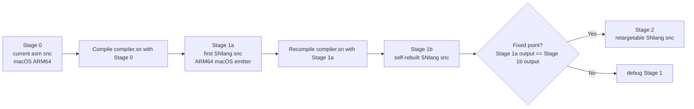
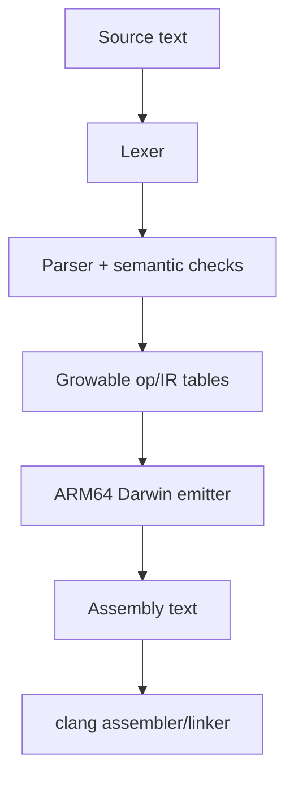

### SNlang Self-Hosting and Retargeting Roadmap

#### Executive summary

`snc` is already a substantial real compiler written in hand-written ARM64 assembly. Per the verified current state, it builds cleanly and passes `make assert` (`254/254`). Typed pthread-backed `task<T>` / `async` / `await` is available for zero-argument functions returning `int`, `bool`, or `str`, with task states/errors, timed waits, cooperative cancellation, and structured task scopes.

That means the main self-hosting blocker is no longer “the language is too small.” The verified feature set covers the essentials for a compiler implementation, and the driver plumbing, dynamic compiler/runtime pools, managed phase arena, and growable StringBuilder are implemented. The remaining work is the SNlang-level vector/dict convenience layer, then the self-hosted parser, code generator, and fixed-point bootstrap proof.

#### One-line verdict

**Self-hosting is feasible now, but only if SNlang first reaches an ARM64/macOS fixed point before any serious x86-64, Linux, or Windows retargeting work begins.**

> **Progress note (2026-07-09).** Three concrete steps toward self-hosting landed: the
> compiler's **operation and print/data tables are now `malloc`-backed and grow on demand**
> (no more `too many operations` / `too many print statements`), a new **`ord(s)` builtin**
> exposes character codes (so SNlang can classify characters), and the **first self-hosting
> component now exists** — `selfhost/lexer.sn`, a tokenizer written in SNlang, compiled by
> `snc` and run via `make selfhost`. This starts milestone `M3` below.

#### Grounded baseline for this roadmap

- `Stage 0` is the current assembly compiler in `src/*.s`.
- Its contract today is `source.sn -> ARM64 macOS assembly text on stdout -> external clang`.
- The only verified host/target is macOS ARM64.
- `src/platform.inc` and parts of `src/data.s` contain `_WIN32` groundwork, but there is no verified Windows build.
- Language-level `argc`/`argv`, `exec`/`system`, substantially larger compiler tables, and a `1MB` source buffer have now been **implemented** (see the prerequisites table); this roadmap covers the work that remains beyond them.

---

### What “self-hosted” means here

For this repo, “self-hosted” should mean:

1. the compiler implementation is written in SNlang rather than hand-written assembly,
2. that SNlang compiler can compile its own SNlang source,
3. the resulting compiler can recompile itself without semantic drift, and
4. the self-hosted compiler initially preserves the current external model: emit assembly text first, then assemble/link with an external toolchain.

The shortest path is therefore **not** a redesign. It is a port of the existing architecture:

- `src/lexer.s` → SNlang lexer
- `src/parser.s` + `src/vars.s` → SNlang parser/semantic recorder
- `src/data.s` op tables and state → SNlang growable tables
- `src/codegen.s` → SNlang ARM64/Darwin emitter
- `src/main.s` → SNlang driver

#### Classic bootstrap vs. this project’s staging

Classic terminology is:

- `stage0`: trusted seed compiler
- `stage1`: self-host compiler built by `stage0`
- `stage2`: the same self-host compiler rebuilt by `stage1`
- fixed point: `stage1` output equals `stage2` output

For this project, the concrete stages are:

- `Stage 0`: current assembly `snc` on macOS ARM64
- `Stage 1`: SNlang-written compiler, built by `Stage 0`, still emitting ARM64 macOS assembly
- `Stage 2`: the SNlang-written compiler after backend factoring and retargeting to x86-64 plus Linux/Windows

The clean way to reconcile those meanings is to treat the **fixed-point proof as a gate inside Stage 1, before Stage 2 starts**.

#### Concrete fixed-point proof for this repo

For `snc`, the deterministic product is emitted assembly text, so the primary proof should be:

1. `stage0_snc` compiles the SNlang compiler source to `compiler.stage1.s`
2. `clang` assembles/links that into `stage1_snc`
3. `stage1_snc` compiles the exact same compiler source to `compiler.stage2.s`
4. `diff -u compiler.stage1.s compiler.stage2.s` is empty

That should be paired with a secondary proof: both generated compilers must also preserve the full `make assert` corpus and the `examples/` sweep behavior. Comparing final executables is optional; linkers may add non-semantic metadata, while identical emitted assembly is directly aligned with this compiler’s actual contract.

---

### Prerequisites checklist

The compiler-in-SNlang does not need every future feature, but it does need a minimum runtime and driver surface. Status below is based on the verified current repo state.

| Prerequisite | Why it matters for self-hosting | Current repo reality | Status |
|---|---|---|---|
| Language-visible `argc` / `argv` | The compiler driver must accept source paths, output paths, and target flags | Implemented as the `argc()` and `argv(i)` builtins (ops 115/116); the emitted `_main` saves host `argc`/`argv` into `_snc_argc`/`_snc_argv` | **Done** |
| `exec` / `system` or equivalent driver hook | Stage 1 still wants to invoke `clang` or a cross toolchain after emitting assembly | Implemented as the `system(cmd)`/`exec(cmd)` builtin (op 114), returning the child exit code; works for literal and dynamically-built command strings | **Done** |
| Growable compiler-internal tables | The compiler source will exceed today’s hard caps quickly | **All compiler-internal tables are now `malloc`-backed and grow on demand.** The op/print tables (`_snc_grow_ops`/`_snc_grow_prints`) plus the variable and function tables (`_snc_grow_vars`/`_snc_grow_fns`, all in `src/vars.s`) realloc-double from an initial cap; the `SNC_MAX_*` values are now only the *initial* sizes. Verified with a 60k-op / 20k-print program, a 5000-variable function, and a 300-function program (all past the old caps) | **Done** |
| Character classification | A lexer must test whether a byte is a digit / letter / whitespace | **`ord(s)` builtin added** (op 118): the ASCII code of a string's first character, so `s[i]` (a 1-char string) can be classified. Used throughout `selfhost/lexer.sn` | **Done** |
| Growable runtime collections | The compiler itself needs symbol tables, intern tables, token vectors, and string-keyed maps | The compile-time `list_pool_*` and `map_pool_*` element pools are now `malloc`-backed and grow on demand (`_snc_grow_list_pool`/`_snc_grow_map_pool` in `src/vars.s`), verified with a 5000-element list and a 5000-entry map (past the old 4096 cap). A SNlang-level growable vector/dict *API* for the self-hosted compiler runtime is still M2 work | **Done (compiler pools); M2 for the SNlang-level API** |
| Robust string building | Codegen must emit large `.s` files without quadratic `+` concatenation behavior | `builder_new()`, `builder_append()`, `builder_append_int()`, `builder_string()`, `builder_clear()`, and `builder_length()` provide a checked growable buffer | **Done (runtime primitive)** |
| Sufficient file I/O | The compiler must read source and write generated assembly | `file_read` and `file_write` are verified and already sufficient for whole-file workflows | **Done** |
| Reliability and diagnostics | Bootstrap bugs amplify quickly; failures must be local and readable | `src/data.s` already contains many `msg_expected_*` and `msg_too_many_*` diagnostics, and `try/catch/throw` is verified | **Done (baseline)** |
| Long-run memory discipline | Leak-by-design is fine for tiny CLI programs, risky for a compiler | Computed strings, file buffers, and builder storage use a thread-safe managed arena. `mem_collect()` resets it explicitly, and program shutdown collects it automatically after workers join. Raw `alloc()` remains manual | **Done for phase/process arenas; object-lifetime RC remains deferred** |
| Source-size headroom | The compiler should not only work if it barely fits one static source buffer | The source buffer is now `malloc`-backed and grows during read (`_snc_grow_src`); a stale-condition-flag bug in the read loop that rejected all input was fixed. Verified with a **1.42 MB** source (past the old 1MB cap) | **Done** |

#### Immediate interpretation of that checklist

- Enough **language** exists to write a compiler now.
- The **fixed-cap blockers are gone**: every compiler table, the `list`/`map` runtime pools, and the source buffer now grow dynamically. The compiler-grade **string/output builder** and phase/process **managed arena** are also implemented; the remaining M2 work is a convenient SNlang-level growable vector/dict API.
- Therefore the next work is the remaining runtime API (M2), then the actual lexer/parser/codegen port (M3–M5).

---

### Recommended implementation shape for Stage 1

The safest first self-hosted compiler is a direct structural mirror of the current seed.

#### Design rules for the first SNlang compiler

- Keep it single-threaded; do not use `spawn` inside the compiler during bootstrap.
- Keep the current output contract: assembly text first, external toolchain second.
- Keep the current “no optimizer required” stance.
- Prefer vectors plus integer ids over object-heavy internal designs until the object caps in `src/data.s` are gone.
- Treat `stdlib/std/io.sn`, `stdlib/std/string.sn`, and `stdlib/std/math.sn` as too small to be the compiler runtime; ship compiler-specific support modules instead.

#### Strong recommendation: port the op-table model first

Today the parser records into `op_kinds` and `op_arg0..op_arg4`, and `src/codegen.s` walks those tables. That gives the lowest-risk migration path:

1. reproduce the same logical IR/op model in SNlang,
2. make it growable,
3. prove ARM64/macOS parity,
4. only then decide whether a richer IR is worth introducing.

This minimizes novelty during bootstrap and preserves a direct comparison path to the existing compiler.

---

### Milestone plan

Use the milestones below in order. The key rule is: **end with the Stage 1 fixed-point proof, then start retargeting**.

| Milestone | Entry | Work | Exit |
|---|---|---|---|
| `M0` — Freeze the bootstrap contract | Current Stage 0 baseline is accepted | Declare the first self-hosted target as effectively `aarch64-apple-darwin`; freeze Stage 1 to parity with the current compiler and the same `stdout` assembly contract | Everyone agrees Stage 1 is a parity port, not a redesign; the fixed-point proof is defined in advance |
| `M1` — Finish the immediate prerequisites | `M0` frozen | ~~Land SNlang-level `argc`/`argv`; land `exec`/`system`; land fixed-table growth~~ **all DONE** — every compiler table/pool and the source buffer now `malloc`-grow; remaining M1 polish (optional multi-module compiler source) is no longer forced by an input cap | A SNlang driver can accept flags, emit `.s`, invoke the toolchain, and no longer falls over at realistic compiler sizes — **prerequisites met** |
| `M2` — Build a tiny compiler runtime in SNlang | `M1` available | ~~Add a phase arena and buffered string builder/output writer~~ **DONE as runtime primitives**; add convenient growable vector and string-keyed map/dict APIs for self-hosted compiler code | The runtime can hold thousands of tokens/IR entries and emit large outputs without quadratic string behavior |
| `M3` — Port the lexer | `M2` utilities work | Port `src/lexer.s`, preserve token spellings and interpolation boundaries, add a token-dump mode. **Started:** `selfhost/lexer.sn` already tokenizes NUM / ID / STR / OP (incl. two-char operators) with a token-dump mode (`make selfhost`); float/decimal literals, string escapes, and comments are the remaining lexer cases | Token dumps match the Stage 0 lexer on a golden corpus |
| `M4` — Port the parser and semantic recorder | Lexer parity proven | Port `src/parser.s` and `src/vars.s`; lower into growable SNlang op tables; keep function frames, recursion, list handling, blueprints, and `try/catch/throw` aligned with verified seed behavior | The SNlang compiler parses and lowers the existing assertion corpus with comparable diagnostics |
| `M5` — Port the ARM64/macOS emitter and driver | Parser-to-op lowering works | Port `src/codegen.s`; keep the first emitter ARM64/macOS only; port `src/main.s`; still emit assembly then call `clang` | The SNlang compiler can compile the corpus to valid ARM64/macOS assembly and run representative binaries correctly |
| `M6` — Reach full behavioral parity | End-to-end Stage 1 works on a subset | Run the full `make assert` corpus and the `examples/` sweep through Stage 1; compare Stage 0 vs. Stage 1 emitted assembly on a curated golden subset | Stage 1 preserves the known baseline: `200/200` assertions and the `155/162` example pattern with `7` deliberate negative cases |
| `M7` — Prove the fixed point | Stage 1 is behaviorally stable | Build `stage1a` with Stage 0; rebuild as `stage1b` with `stage1a`; diff the compiler’s own emitted assembly; rerun the corpus with both compilers | `stage1a` and `stage1b` emit identical assembly for the compiler source and preserve the full baseline; `snc` is now self-hosted in the meaningful sense |
| `M8` — Factor backend concerns | `M7` fixed point achieved | Split the backend into at least `IR/op model`, `ISA emitter`, and `platform/ABI descriptor`; move symbol naming, section syntax, prologue/epilogue rules, and assembler strings behind target descriptors | ARM64/macOS still passes unchanged, and the emitter no longer depends on one giant monolith |
| `M9` — Add x86-64 on the simpler non-Windows path first | Backend factoring complete | Implement `x86_64` register and stack rules; prefer the simpler Linux/System V bring-up before Windows; keep the same front-end corpus | The self-hosted compiler can cross-emit x86-64 assembly from the Mac host and pass the corpus on the first x86-64 target |
| `M10` — Add Windows x86-64 support properly | x86-64 non-Windows path works | Implement the real Win64 ABI: args in `RCX`/`RDX`/`R8`/`R9`, `32` bytes of caller shadow space, correct alignment, correct preserved registers; add Windows symbol/section/toolchain handling; treat current `_WIN32` branches only as hints | Windows artifacts link and run under a real Windows environment, including ABI-sensitive nested-call cases |
| `M11` — Add Linux/Windows driver polish | `M10` target support exists | Add clean target selection, good toolchain error reporting, and documented host cross-toolchain requirements | From a Mac host, the self-hosted compiler can drive ARM64 macOS, x86-64 Linux, and x86-64 Windows output paths predictably |

---

### Testing and verification strategy

Testing should become stricter at each stage, not looser.

#### Keep Stage 0 as the oracle until `M7`

Before the fixed point is proven, if Stage 0 and Stage 1 disagree on tokenization, parsing, emitted ARM64 assembly, or runtime behavior, assume Stage 1 is wrong first. Keep a small golden corpus whose tokens, parse behavior, emitted assembly, and runtime output are expected to stay stable.

#### Verification layers

- **Repo-level behavior:** keep using `make assert` and the example sweep as the semantic regression baseline.
- **Internal diagnostics:** add token-dump and parser/op-dump comparisons so front-end bugs can be localized before runtime execution.
- **Emitter parity:** compare Stage 0 and Stage 1 assembly on a curated subset before assembling/running binaries.
- **Self-hosting proof:** `stage0_snc compiler.sn > compiler.stage1.s`, assemble/link, `stage1_snc compiler.sn > compiler.stage2.s`, then `diff -u compiler.stage1.s compiler.stage2.s`.
- **Retargeting proof:** once multiple backends exist, keep the same front-end corpus, compare canonical IR/op dumps across targets, and add ABI-focused tests for many-argument calls, nested calls, caller/callee-saved register pressure, stack alignment, and Windows shadow space.

#### Minimum pass gates by stage

- `M3`: token dumps correct
- `M4`: parser/op lowering correct
- `M5`: representative programs assemble and run
- `M6`: full `make assert` and full example-sweep parity
- `M7`: self-compile diff is empty
- `M9` / `M10`: target-specific corpus passes on the real target environment

---

### Risks and mitigations

| Risk | Why it matters here | Mitigation |
|---|---|---|
| Raw-assembly fragility | The seed compiler is large, low-level, and tightly coupled to emitted assembly strings; a rewrite can easily reintroduce bugs already documented in `ISSUES.md` | Keep Stage 1 structurally close to Stage 0, keep Stage 0 as the oracle, and add dumpable intermediate views: tokens, parse state, and op tables |
| Arena invalidation | `mem_collect()` deliberately invalidates every currently managed computed string and builder handle | Collect only at explicit compiler phase boundaries after live values have been discarded; use `mem_live()`/`mem_bytes()` in stress tests. Object-lifetime reference counting remains deferred until the self-hosted value model is stable |
| ABI differences | Moving from ARM64/macOS to x86-64 and Windows can create subtle wrong-code bugs without obvious crashes | Separate ISA from ABI in `M8`; create ABI-only smoke tests early; explicitly test Win64 shadow space, stack alignment, and preserved registers |
| Fixed caps everywhere | Today’s static capacities in `src/data.s` are a real compiler blocker, not just an inconvenience | Prioritize growable vectors/maps before the SNlang compiler grows large; avoid object-heavy designs until object caps disappear; keep modules small enough to avoid the current `65535`-byte source cap until it is raised |
| Bootstrap bug amplification | Once Stage 1 compiles itself, a bad compiler can reproduce the same bug into later generations | Never discard Stage 0; checkpoint passing Stage 1 binaries; when fixed-point diffs appear, bisect using Stage 0-generated artifacts first |

---

### Explicit non-goals for the near term

Do **not** block self-hosting on any of the following:

- `net/http/tls`
- graphics or audio runtimes
- package manager / registry infrastructure
- LSP or IDE services
- debugger integration
- optimizer passes beyond parity needs
- direct Mach-O / ELF / COFF object emission

The near-term target is much smaller and much more valuable:

- a self-hosted SNlang compiler that matches today’s ARM64/macOS behavior,
- a proven Stage 1 fixed point,
- then a clean path to x86-64 plus Linux/Windows backends.

---

### Recommended order of attack in one sentence

**Finish the in-progress driver/runtime prerequisites, port the current compiler architecture into SNlang with growable data structures, prove the ARM64/macOS fixed point, and only then split the backend for x86-64 plus Linux/Windows support.**